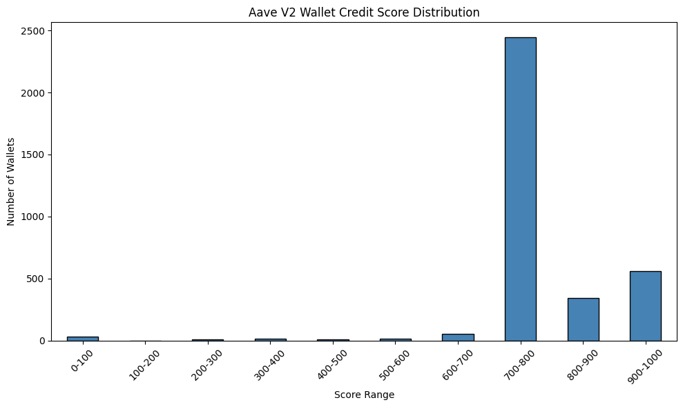

 ## Analysis of Aave V2 Wallet Credit Scores

 This document presents an analysis of credit scores assigned to wallets interacting with the Aave V2 protocol, based on our XGBoost-based machine learning model.
The credit scoring system evaluates each wallet’s behavior using historical on-chain transaction data, identifying reliable users and flagging potential risk.

## Dataset Overview

Source: 100,000 on-chain transactions (Aave V2, Polygon)

Processed wallets: ~3,497 unique wallets

Score Range: 0 (high risk) → 1000 (low risk, reliable)

Model: XGBoost trained on synthetic labels derived from behavioral heuristics

## Score Distribution

## Key Observations:

 Most wallets score 600–800: Indicates the majority of users exhibit healthy borrowing & repayment practices.

Peak in 650–700 range: Represents the baseline user, with moderate activity & low risk.

Few wallets below 400: These wallets display risky patterns such as high liquidation rates or no repayments.

Wallets scoring 850+: Exhibit exceptional behavior — active, responsible, no liquidations.

## High-Scoring Wallets (850–1000)

These wallets represent the most reliable segment in our data.

Behavioral Characteristics:

Zero liquidations

Repayment-to-borrow ratio ≈ 1.0 (fully or over-repaid)

Healthy borrow-to-deposit ratio (<0.7)

High activity days & consistent engagement

High USD transaction volumes

Conclusion:
Highly reliable, engaged users — ideal candidates for higher limits or rewards.

## Mid-Scoring Wallets (600–850)

This is the largest segment, encompassing the majority of users.

Behavioral Characteristics:

Occasional minor liquidations or late repayments

Moderate borrow-to-deposit ratios (healthy leverage)

Active on several unique days

Medium transaction volumes

Conclusion:
Generally responsible, low-to-medium risk users — typical retail borrowers.

## Low-Scoring Wallets (0–400)

This small but significant group demonstrates clear risk signals.

Behavioral Characteristics:

Liquidation rates >50% — often over-leveraged

Repayment-to-borrow ratio <0.5 — very little or no repayment

Very low active days — typically single-day interactions

Possibly bots, exploit attempts, or abandoned wallets

Low USD volumes

Conclusion:
Risky or inactive users — should be flagged for tighter risk controls.

## Effectiveness of the Model

The model successfully stratifies wallets into meaningful segments, based on engineered features and behavioral risk signals.

Aligns well with expected DeFi user patterns:

Responsible retail borrowers cluster around 700–800

Bots & risky actors occupy the lower ranges

Ideal users shine above 850